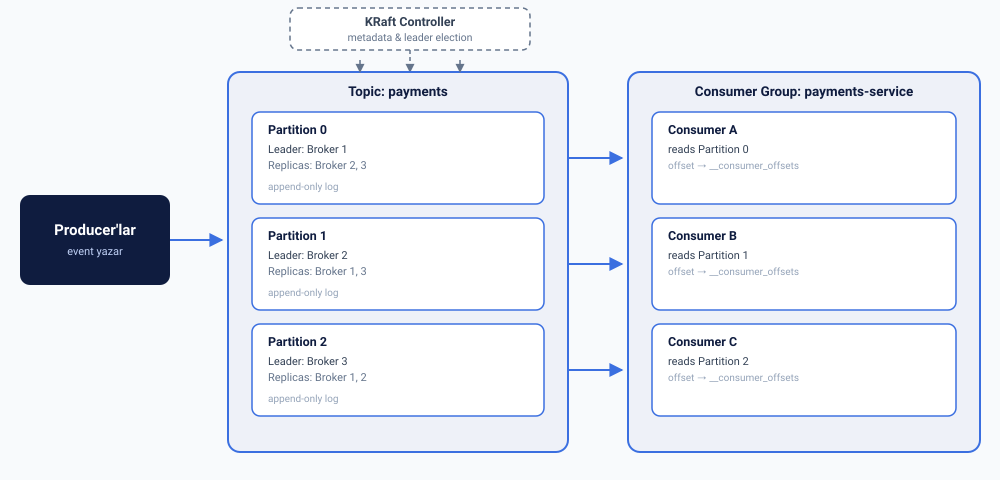

Kafka'yı üretimde güvenli kullanmak için mimarisini, kritik konfigürasyonları
ve Kafka'nın kendi başına çözemediği dual-write problemini anlamak gerekiyor.
Bu yazıda bu üçünü bir arada topladım.

{/* truncate */}

## Genel mimari

Kafka mimarisinin temel bileşenleri: producer'lar event'leri topic'lere yazar,
Kafka cluster bunu partition'lara bölerek broker'larda saklar, consumer'lar
consumer group içinde bu partition'ları paralel okur, ve KRaft controller
cluster metadata'sını ve broker koordinasyonunu yönetir.



## Topic ve partition

Kafka'da veri topic'lerde tutulur, ama asıl kritik kavram partition'dır — bir
topic tek bir dosya değil, birden fazla partition'a bölünmüş haldedir. Bu
bölünme:

- Partition'ların farklı broker'lara dağıtılmasını sağlar → yatay ölçeklenme
- Aynı topic'in birden fazla consumer tarafından paralel okunmasına imkan verir
- Her partition kendi içinde sıralıdır (append-only log) — ama partition'lar
  arası sıra garantisi yoktur

Kafka "topic bazında sıra garantisi" vermez, **partition bazında** verir. Sıra
garantisi gerekiyorsa (örn. bir kullanıcının event'leri sırayla işlensin),
aynı key'e sahip mesajlar hep aynı partition'a gider (key hash'i partition
seçer).

## Broker ve replication

Her partition bir broker'da **leader** olarak durur, diğer broker'larda
**replica** (kopya) olarak tutulur. Yazma/okuma hep leader üzerinden yapılır;
leader çökerse replica'lardan biri otomatik leader olur.
`replication.factor=3` demek her partition'ın 3 kopyası olduğu anlamına
gelir — bu, broker kaybında veri kaybını önler.

## Controller (KRaft)

Eski Kafka sürümlerinde bu iş Zookeeper'a devredilmişti; artık Kafka kendi
içinde **KRaft** protokolüyle bunu yönetiyor — hangi broker'ın hangi
partition için leader olduğu, cluster metadata'sı gibi kararlar Zookeeper'sız,
Kafka'nın kendi Raft tabanlı consensus mekanizmasıyla veriliyor. Bu,
operasyonel karmaşıklığı ciddi azalttı (ayrı bir Zookeeper cluster'ı işletmeye
gerek kalmıyor).

## Consumer group

Bir consumer group içindeki consumer'lar partition'ları aralarında paylaşır —
her partition sadece bir consumer tarafından okunur (aynı group içinde). Bu
paralel işleme sağlar, ama bir partition'ı aynı anda iki consumer okuyamaz.
Consumer sayısı partition sayısını geçerse fazla consumer'lar boşta kalır —
partition sayısı paralellik tavanını belirler.

**Offset**, her consumer'ın "nereye kadar okudum" bilgisini tutar — bu da özel
bir internal topic'te (`__consumer_offsets`) saklanır.

## Sonraki konular

- Partition sayısı nasıl belirlenmeli
- Exactly-once semantics
- Consumer group rebalancing mekaniği

## Config sözlüğü — ne işe yarar

### Producer configleri

- `acks` — Producer'ın bir yazmayı "başarılı" saymadan önce kaç replica'nın
  onay vermesini bekleyeceğini belirler. `0` = hiç bekleme (fire-and-forget),
  `1` = sadece leader'ın yazması yeterli, `all`/`-1` = tüm in-sync
  replica'ların yazması gerekir. Değer arttıkça dayanıklılık artar, gecikme de
  artar.
- `enable.idempotence` — Açıldığında Kafka her mesaja bir sıra numarası ve
  producer ID ekler; bu sayede producer'ın retry sonucu aynı mesajı iki kez
  yazması engellenir (duplicate önleme). Açıldığında Kafka `acks=all`, yüksek
  `retries` ve `max.in.flight.requests.per.connection≤5` değerlerini otomatik
  zorunlu kılar.
- `retries` — Geçici bir hata (network kopması, geçici broker erişilemezliği
  vb.) olduğunda producer'ın mesajı kaç kez tekrar göndermeyi deneyeceği.
- `max.in.flight.requests.per.connection` — Producer'ın onay beklemeden art
  arda kaç istek gönderebileceği. Yüksek değer throughput artırır ama
  idempotence kapalıyken sıra bozulmasına (reordering) yol açabilir.
- `linger.ms` / `batch.size` — Producer'ın mesajları göndermeden önce ne kadar
  bekleyip biriktireceği (batching). Daha büyük batch = daha yüksek
  throughput, daha yüksek gecikme.
- `compression.type` — Mesajların hangi algoritmayla (`snappy`, `lz4`,
  `zstd`, `gzip`) sıkıştırılacağı. Ağ ve disk kullanımını azaltır.
- `transactional.id` — Producer'a sabit bir kimlik atar ve Kafka'nın
  transaction API'sini (birden fazla yazma işlemini atomik yapma)
  kullanmasını sağlar. "Mesajı yaz" ve "offset'i commit et" gibi adımların ya
  hep birlikte ya da hiç gerçekleşmemesini garanti eder.

### Broker / topic configleri

- `default.replication.factor` — Her partition'ın kaç kopyasının (replica)
  tutulacağı. Bir broker kaybında veri kaybını önler.
- `min.insync.replicas` — Bir yazmanın onaylanması için en az kaç replica'nın
  senkron (in-sync) olması gerektiği. `acks=all` ile birlikte çalışır; bu
  ikisi bir arada dayanıklılık seviyesini belirler.
- `unclean.leader.election.enable` — Senkron olmayan (eski/eksik veri
  içeren) bir replica'nın leader seçilmesine izin verilip verilmeyeceği.
  `true` olursa availability artar ama veri tutarlılığı riske girer; `false`
  olursa tam tersi.
- `cleanup.policy` — Eski verinin nasıl temizleneceği. `delete`: zaman/boyut
  sınırına göre siler. `compact`: her key için sadece en son değeri tutar,
  önceki değerleri siler — state/snapshot tarzı kullanım için uygundur.
- `log.retention.hours` / `log.retention.bytes` — Verinin ne kadar süre veya
  boyutta saklanacağı.
- `num.partitions` — Yeni topic'ler için varsayılan partition sayısı;
  paralellik tavanını belirler.

### Consumer configleri

- `enable.auto.commit` — Consumer'ın okuduğu mesajların offset'ini otomatik
  mi (periyodik aralıklarla) yoksa manuel mi commit edeceği. Otomatik commit,
  mesaj işlenirken hata olsa bile offset'in ilerlemiş olma riski taşır.
- `isolation.level` — Consumer'ın transactional producer'lar tarafından
  yazılan ama henüz commit edilmemiş (abort edilmiş olabilecek) mesajları
  okuyup okumayacağı. `read_committed` sadece commit edilmiş veriyi gösterir.
- `auto.offset.reset` — Consumer'ın kayıtlı bir offset bulamadığında nereden
  okumaya başlayacağı. `earliest`: topic'in başından, `latest`: sadece yeni
  gelen mesajlardan.
- `max.poll.records` — Bir `poll()` çağrısında en fazla kaç mesajın alınacağı.
- `session.timeout.ms` / `heartbeat.interval.ms` — Consumer'ın "canlı"
  sayılması için broker'a ne sıklıkla sinyal (heartbeat) göndermesi gerektiği
  ve ne kadar sessiz kalırsa ölü sayılıp group'tan çıkarılacağı.

### Güvenlik configleri

- **SSL/TLS** — Veri transit halindeyken (network üzerinde) şifrelenip
  şifrelenmeyeceği.
- **ACL'ler** (`authorizer.class.name`) — Hangi servisin/kullanıcının hangi
  topic'e yazma veya okuma izni olduğunu kısıtlayan yetkilendirme mekanizması.

### Bu configler neden önemli — ödeme örneği

Ödeme gibi "veri kaybı ve duplicate kabul edilemez" senaryolarda genelde bir
araya gelen configler: `acks=all`, `enable.idempotence=true`,
`min.insync.replicas=2`, `unclean.leader.election.enable=false`,
`enable.auto.commit=false` (manuel commit), `isolation.level=read_committed`,
`transactional.id` set edilmiş. Bunun nedeni her birinin tek başına kapattığı
farklı bir veri kaybı/duplicate senaryosu olması — birlikte kullanıldıklarında
uçtan uca (producer → broker → consumer) garanti oluştururlar.

## Outbox pattern — neden gerekli

Kafka'nın sıkı configleri (`acks=all`, `enable.idempotence`,
`transactional.id` vb.) Kafka'nın kendi içindeki garantileri kapsıyor. Asıl
boşluk Kafka'nın dışında, veritabanı yazma ile Kafka'ya event gönderme
arasında yaşanıyor.

### Dual-write problemi

Tipik akış:

```
1. Ödeme kaydını DB'ye yaz (status: completed)
2. Kafka'ya "ödeme tamamlandı" event'i gönder
```

Bunlar iki ayrı sistem, iki ayrı işlem — aralarında atomiklik yok. Olabilecek
senaryolar:

- DB yazımı başarılı olur, event'i Kafka'ya göndermeden önce servis çöker →
  ödeme DB'de "tamamlandı" ama hiçbir sistem haberdar değil
- Event Kafka'ya başarıyla gönderilir, DB transaction'ı rollback olur →
  Kafka'da "ödeme tamamlandı" event'i var ama DB'de öyle bir kayıt yok
- Kafka'ya yazma timeout alır, retry edilir, ama aslında ilk deneme de
  gitmiştir → duplicate event (idempotence bunu Kafka içi retry'lar için
  çözer, uygulama kodunun kendi retry mantığı için çözmez)

İki farklı sistem (DB + Kafka) arasında dağıtık transaction (2PC) kurmak da
hem karmaşık hem performans açısından kötü.

### Outbox pattern'in çözdüğü şey

Kafka'ya direkt yazmak yerine, aynı DB transaction'ı içinde bir "outbox"
tablosuna da satır yazılır:

```sql
BEGIN;
  INSERT INTO payments (...) VALUES (...);
  INSERT INTO outbox (event_type, payload) VALUES ('payment.completed', '{...}');
COMMIT;
```

Bu ikisi aynı transaction'da olduğu için atomiklik veritabanının kendi ACID
garantisinden gelir — ya ikisi de yazılır, ya hiçbiri. "DB yazıldı ama event
kayboldu" senaryosu artık imkansız.

Sonra ayrı bir süreç (genelde **CDC** — Change Data Capture, örn.
**Debezium**) outbox tablosunu izler ve oradaki satırları Kafka'ya güvenilir
şekilde aktarır. Bu süreç kendi retry/at-least-once mantığını yürütür; kaynak
veri (outbox tablosu) kalıcı ve tutarlı olduğu için kayıp riski yok — CDC
süreci çökse bile tablo hâlâ orada, kaldığı yerden devam eder.

### Kafka configleri vs outbox pattern

| Kafka configleri | Outbox pattern |
| --- | --- |
| Kafka'ya yazma işleminin kendisini güvenceye alır | DB yazımı ile Kafka'ya yazma isteğinin atomikliğini sağlar |
| "Mesaj Kafka'ya ulaştı mı, kayboldu mu" sorusuna cevap | "İş mantığı ile event yayınlama birbirinden koptu mu" sorusuna cevap |
| Broker/producer/consumer seviyesinde çalışır | Uygulama + veritabanı seviyesinde çalışır |

İkisi birbirinin yerine geçmiyor, tamamlıyor — sıkı Kafka configleri olmadan
outbox da yeterli olmaz (Kafka'ya giden yolda veri kaybolabilir), outbox
olmadan da sıkı Kafka configleri yeterli olmaz (DB-Kafka arası tutarsızlık
hâlâ mümkün).
