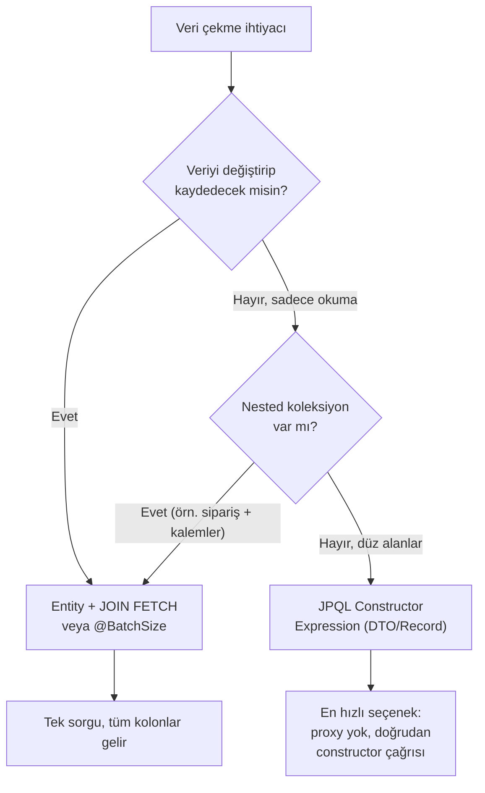

N+1 problemi, JPA/Hibernate ile çalışan hemen her ekibin er ya da geç
karşılaştığı, fark edilmesi kolay ama etkisi ölçülmeden hafife alınan bir
performans sorunudur. Bu yazıda hem sorunun kaynağını, hem çözüm yollarını,
hem de en kritik kısmı ele alıyoruz: projection türü seçiminin performansı ne
kadar değiştirdiğini, gerçek benchmark verileriyle.

{/* truncate */}

## N+1 Problemi Nedir

Bir koleksiyonu (`List<Order>`) çektiğinizde, her satır için ilişkili bir
entity'ye (`Customer`) ayrı ayrı erişildiğinde Hibernate her biri için ek bir
sorgu çalıştırır. Sonuç: 1 sorgu (liste) + N sorgu (her satırın ilişkisi) =
N+1 sorgu.

```java
@Entity
class Order {
    @ManyToOne(fetch = FetchType.LAZY)
    private Customer customer;
}

List<Order> orders = orderRepository.findAll(); // 1 sorgu
orders.forEach(o -> o.getCustomer().getName());  // her order için ayrı sorgu → N sorgu
```

Bunun canlıdaki maliyeti soyut değil. 100 civarında entity içeren, en fazla 2
seviyeli bir object graph'ı dönen bir dashboard API'si, N+1 yüzünden 8
saniyeye kadar yanıt süresine çıkabiliyor — kök neden her zaman aynı: listede
gezinirken tetiklenen lazy-load zinciri.

EAGER fetch bunu çözmez, çünkü Hibernate EAGER olsa bile genelde JOIN değil,
ayrı SELECT sorguları üretir; sorunu gizler, ortadan kaldırmaz.

## Klasik Çözümler

**JOIN FETCH (JPQL):**

```java
@Query("SELECT o FROM Order o JOIN FETCH o.customer")
List<Order> findAllWithCustomer();
```

Tek sorguda ilişkiyi getirir. Birden fazla `OneToMany` koleksiyonunu aynı
anda `JOIN FETCH` etmeye çalışırsanız Cartesian product ve
`MultipleBagFetchException` riski doğar.

**EntityGraph:**

```java
@EntityGraph(attributePaths = {"customer", "items"})
List<Order> findAll();
```

Deklaratif ve okunaklı, ama aynı Cartesian product riskini taşır.

**Batch Fetching:**

```java
@BatchSize(size = 20)
private Customer customer;
```

N ayrı sorgu yerine `WHERE id IN (...)` ile gruplar halinde çeker. Cartesian
product riski yok — çoklu koleksiyon senaryosunda en pratik çözümlerden
biri.

## Projection: Sadece İhtiyacınız Olanı Çekmek

Projection, entity'nin tamamı yerine ihtiyaç duyulan alanları çeker. Üç ana
türü var: **interface-based**, **DTO/class-based (constructor expression)**,
ve **scalar (`Object[]`/`Tuple`)**. Ama üçü de aynı performansı vermiyor —
aralarındaki fark, çoğu ekibin tahmin ettiğinden çok daha büyük.



### Interface-Based Projection: Proxy Maliyeti

```java
interface OrderSummary {
    Long getId();
    String getCustomerName();
}
```

Bu basit ve az kod gerektiren bir yöntem gibi görünse de, arka planda ciddi
bir maliyet taşır: Spring Data JPA, sonuç kümesindeki **her satır için ayrı
bir dinamik proxy** oluşturur. Bu proxy, projection interface'ini implemente
eder ve her `getXxx()` çağrısını bir handler'a delege ederek result set'ten
değeri çeker.

Arnold Galovics'in Sakila veritabanı (1000 satır, MySQL 5.7) üzerinde yaptığı
JMH benchmark'ı bunun maliyetini somut olarak gösteriyor:

- Entity fetching: ortalama **~311ms**
- Spring Data JPA interface projection: ortalama **~745ms** (entity'den 2
  kattan fazla yavaş)
- Aynı alanları düz Criteria API/JPQL ile çekmek: ortalama **~48ms**

Yani interface projection, saf JPQL/Criteria yaklaşımına göre **~15 kat**
daha yavaş çıkmış. Sebebi net: reflection tabanlı proxy oluşturma ve
delegation zinciri.

Ayrıca dikkat: interface projection'da `@Value` (SpEL) kullanan **open
projection**'lar tam entity yüklemesini zorlar ve projection'ın sağladığı
tüm kazancı sıfırlar. **Closed projection** (tüm alanlar hedef entity
property'leriyle birebir eşleşen) kullanmak, Spring Data'nın sorguyu
optimize etmesine izin verir — SpEL'den kaçının.

### DTO / Record Projection (Constructor Expression): Kazanan Yöntem

```java
public record OrderSummary(Long id, String customerName, BigDecimal total) {}

@Query("SELECT new com.app.dto.OrderSummary(o.id, o.customer.name, o.total) FROM Order o")
List<OrderSummary> findSummaries();
```

Burada Hibernate, proxy üretmek yerine doğrudan Java constructor'ını çağırır
— JVM için native bir nesne oluşturma işlemi, reflection tabanlı interception
yok. Bu, ölçümlerdeki farkın temel nedeni:

> JPQL constructor expression'lar en hızlı projection tipidir; interface
> proxy'lere göre yaklaşık **10 kat** daha hızlı çalışır ve hiçbir entity
> yönetim overhead'i gerektirmez.

Başka bir JMH benchmark'ı (50.000 kayıt) bunu farklı bir açıdan doğruluyor:
entity çekip sonradan manuel DTO'ya map eden yaklaşım, diğer yöntemlere göre
**3 kat** daha yavaş çıkmış — yani "entity yükle, sonra dönüştür" ile
"JPQL'de doğrudan `SELECT new DTO(...)` yaz" arasında da ciddi fark var.
İkincisi kazanıyor.

**Criteria API'ye gerek yok mu?** Hayır — JPA'nın class-based projection
döndürme mekanizması zaten constructor expression'lardır. Düz JPQL'de
`SELECT new ...` yazmak yeterli; Hibernate arkada aynı şekilde doğrudan
constructor çağırıyor. Criteria API sadece runtime'da hangi alanların
seçileceği dinamikse (programatik sorgu oluşturma) fark yaratır; statik
projection'larda JPQL ile performans farkı yoktur.

### Kritik Sınır: DTO Her Zaman Kazandırmaz

Burada gözden kaçırılmaması gereken bir nokta var. DTO projection, **tek
seviyeli düz alan seçiminde** açık ara en hızlı seçenek. Ama **nested
koleksiyon** içeren senaryolarda (bir sipariş + sipariş kalemleri gibi)
durum tersine dönebilir: ilişkili koleksiyonları ayrı DTO'lar olarak çekmek
genelde çok fazla ek sorguya ihtiyaç duyurur, ve bu ek sorgular DTO'nun
kazancını fazlasıyla götürür. Böyle senaryolarda genelde en hızlı seçenek
entity kullanıp ilişkileri sorgu içinde (`JOIN FETCH` + `@BatchSize`)
initialize etmektir — çünkü tek bir constructor expression içine birden
fazla koleksiyon sığdıramazsınız.

Ayrıca projection'lar sadece hedef entity'nin top-level property'lerine
sınırlıdır; nested property'ler join'e çözüldüğünde ilgili join tam olarak
materialize olur — yani `o.customer.name` seçmek arkada otomatik join
tetikler (bu genelde istenen davranıştır, N+1 yaratmaz, ama farkında
olunmalı).

## Özet Karşılaştırma

| **Yöntem** | **Göreceli Hız** | **Neden** |
| --- | --- | --- |
| N+1 (lazy, döngüde erişim) | En kötü | Satır sayısı kadar ek sorgu |
| Entity + manuel DTO mapping | Yavaş (~3x kayıp) | Tam entity yükleniyor + sonradan mapping |
| Entity + JOIN FETCH / EntityGraph | Orta-iyi | 1 sorgu ama tüm kolonlar geliyor |
| Interface projection | Değişken, bazen yavaş | Satır başına dinamik proxy overhead'i |
| JPQL constructor expression (DTO/Record) | En hızlı (~10x interface'e göre) | Doğrudan constructor çağrısı, proxy/mapping yok |

## Pratik Öneriler

- **Liste/rapor endpoint'lerinde (salt okuma, tek seviyeli alanlar):** JPQL
  constructor expression + Java Record kullanın. En hızlı ve en az riskli
  seçenek.
- **Nested koleksiyon gerektiren senaryolarda:** Entity + `JOIN FETCH` +
  `@BatchSize` kombinasyonunu tercih edin.
- **Update/delete yapılacak entity'lerde:** Projection kullanmayın —
  Hibernate'in dirty checking ve transaction yönetimi için tam managed
  entity gerekir.
- **Interface projection'ı** sadece basit, düşük hacimli veya hızlı
  prototipleme senaryolarında tercih edin; yüksek hacimli read path'lerde
  DTO/Record'a geçin.
- SpEL (`@Value`) tabanlı open projection'lardan kaçının — tam entity
  yüklemesini tetikler.
- `spring.jpa.properties.hibernate.generate_statistics=true` ve
  `hibernate.SQL` log seviyesini açarak N+1'i gerçek sorgu sayısıyla
  doğrulayın; varsayımla değil, ölçerek karar verin.

## Kapanış

N+1 problemi kolayca fark edilir ama projection türü seçimi çoğu zaman
gözden kaçar — oysa ölçümler gösteriyor ki bu seçim, sorgu sayısını 1'e
indirmek kadar önemli bir performans faktörü olabiliyor. "Projection
kullandım, hızlandı" varsayımına güvenmek yerine, kendi entity/sorgu
şeklinizle kısa bir mikro-benchmark koşup gerçek sayıları görmek, doğru
kararı vermenin en güvenilir yolu.
