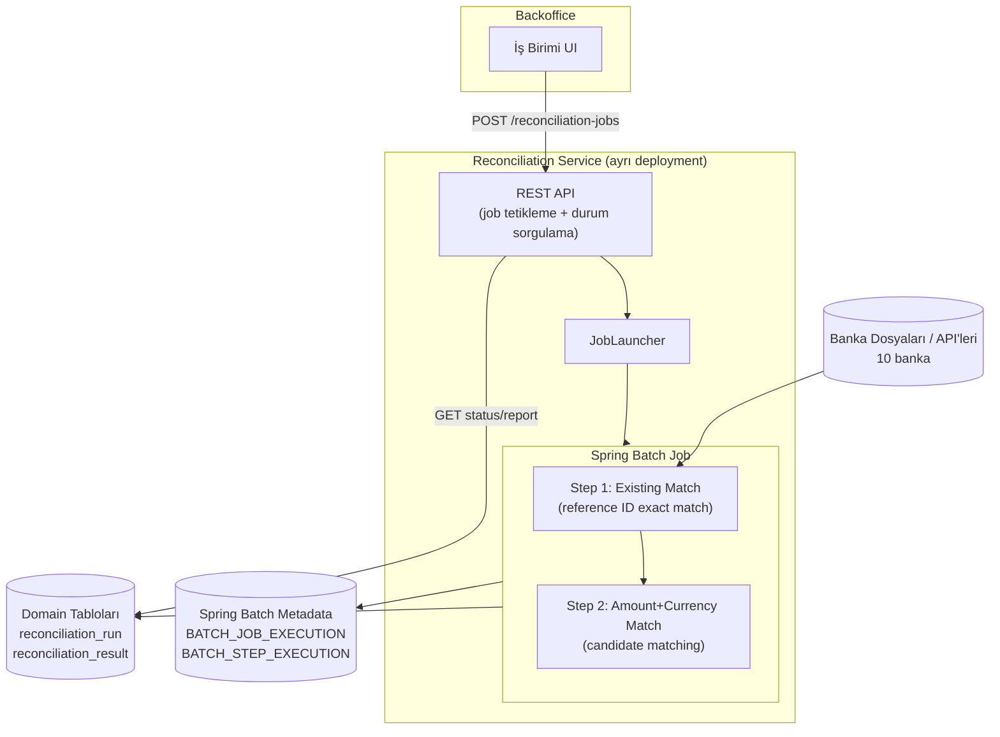

10 farklı banka ile milyonlarca ödeme kaydının mutabakatını yapmamız
gerekiyordu. Gereksinimler net ama birbirine gerilim yaratıyordu: hatasız,
performanslı ve ana ödeme akışını kesmeyecek. Bu yazıda bu üç kısıtı bir
arada karşılayan, Spring Batch üzerine kurulu partitioned ve restart
edilebilir pipeline'ın mimari kararlarını anlatıyorum.

{/* truncate */}

## Problem

10 farklı banka ile milyonlarca ödeme kaydının mutabakatını yapmamız
gerekiyordu. Gereksinimler net ama birbirine gerilim yaratıyordu: **hatasız**
(bir kayıt bile kaybolmayacak veya çift işlenmeyecek), **performanslı**
(milyonlarca satır makul sürede bitecek) ve **sistemin ana akışını
kesmeyecek** (production ödeme akışına dokunmayacak). Bu üç kısıt bir arada,
basit bir `for` döngüsüyle çözülebilecek bir problem değil — restart,
checkpoint, transaction sınırları ve paralellik gerektiriyor. Bunun için
Spring Batch'i seçtik.

## Neden Spring Batch

Büyük hacimli veriyi elle işlemeye kalkışırsanız checkpointing, transaction
yönetimi, restart mekanizması, concurrency kontrolü ve idempotency
güvenceleri için kendi altyapınızı yazmanız gerekir. Bu altyapı kodu zamanla
asıl iş mantığından daha karmaşık hale gelir. Spring Batch bu sorunları
çözülmüş problemler olarak sunar: chunk-oriented processing, transaction
sınırları, restart/skip/retry politikaları ve execution tracking hazır gelir.

## Mimari: Ayrı Bir Servis Olarak

Mutabakat pipeline'ı mevcut uygulamalardan **ayrı bir servis/deployment**
olarak tasarlandı:

- Milyonlarca kayıt işleyen bir job, ana uygulamayla aynı JVM'de çalışırsa
  CPU/memory contention yaratır ve ödeme akışını etkileyebilir.
- Batch servisinin kendi connection pool'u var — ana uygulamanın pool'unu
  paylaşmıyor.
- K8s'te bağımsız resource limit ve scaling ile CronJob/Job olarak
  modellenebiliyor.
- Deploy bağımsızlığı: mutabakat mantığında değişiklik için ana payment
  servisini redeploy etmeye gerek yok.



## Job/Step Yapısı ve İki Aşamalı Matching

Her banka için ayrı bir job instance'ı, iki step'ten oluşuyor: önce exact
match (existing match), sonra kalanlar için amount+currency+tarih penceresi
ile candidate matching.

```java
@Configuration
public class ReconciliationJobConfig {

    @Bean
    public Job bankReconciliationJob(JobRepository jobRepository,
            Step existingMatchStep,
            Step amountCurrencyMatchStep) {
        return new JobBuilder("bank-reconciliation-job", jobRepository)
                .start(existingMatchStep)
                .next(amountCurrencyMatchStep)
                .build();
    }

    @Bean
    public Step existingMatchStep(JobRepository jobRepository,
            PlatformTransactionManager txManager,
            ItemReader<BankRecord> existingMatchReader,
            ItemProcessor<BankRecord, ReconciliationResult> existingMatchProcessor,
            ItemWriter<ReconciliationResult> reconciliationResultWriter) {
        return new StepBuilder("existing-match", jobRepository)
                .<BankRecord, ReconciliationResult>chunk(1000, txManager)
                .reader(existingMatchReader)
                .processor(existingMatchProcessor)
                .writer(reconciliationResultWriter)
                .faultTolerant()
                .skipLimit(100)
                .skip(DataIntegrityViolationException.class)
                .build();
    }

    @Bean
    public Step amountCurrencyMatchStep(JobRepository jobRepository,
            PlatformTransactionManager txManager,
            ItemReader<BankRecord> unmatchedReader,
            ItemProcessor<BankRecord, ReconciliationResult> amountCurrencyProcessor,
            ItemWriter<ReconciliationResult> reconciliationResultWriter) {
        return new StepBuilder("amount-currency-match", jobRepository)
                .<BankRecord, ReconciliationResult>chunk(1000, txManager)
                .reader(unmatchedReader)
                .processor(amountCurrencyProcessor)
                .writer(reconciliationResultWriter)
                .build();
    }
}
```

### Reader — keyset pagination, cursor değil

`JdbcCursorItemReader` tek bir DB cursor'ı açık tutar, büyük veri setlerinde
lock riski ve uzun süre açık connection anlamına gelir. Bunun yerine keyset
pagination kullanan bir `JdbcPagingItemReader` tercih edilir — `OFFSET N`
sorgularının aksine, veri büyüdükçe performansı sabit kalır.

```java
@Bean
@StepScope
public JdbcPagingItemReader<BankRecord> existingMatchReader(
        DataSource dataSource,
        @Value("#{jobParameters['bankId']}") String bankId) {

    Map<String, Order> sortKeys = new HashMap<>();
    sortKeys.put("id", Order.ASCENDING);

    PostgresPagingQueryProvider queryProvider = new PostgresPagingQueryProvider();
    queryProvider.setSelectClause("SELECT id, reference_id, amount, currency, value_date");
    queryProvider.setFromClause("FROM bank_incoming_record");
    queryProvider.setWhereClause("WHERE bank_id = :bankId AND status = 'PENDING'");
    queryProvider.setSortKeys(sortKeys);

    Map<String, Object> params = new HashMap<>();
    params.put("bankId", bankId);

    return new JdbcPagingItemReaderBuilder<BankRecord>()
            .name("existingMatchReader")
            .dataSource(dataSource)
            .queryProvider(queryProvider)
            .parameterValues(params)
            .pageSize(1000)
            .rowMapper(new BankRecordRowMapper())
            .build();
}
```

### Processor — eşleştirme mantığı

```java
@Component
public class ExistingMatchProcessor implements ItemProcessor<BankRecord, ReconciliationResult> {

    private final PaymentRecordRepository paymentRecordRepository;

    @Override
    public ReconciliationResult process(BankRecord bankRecord) {
        return paymentRecordRepository.findByReferenceId(bankRecord.getReferenceId())
                .map(payment -> ReconciliationResult.matched(bankRecord, payment, MatchType.EXISTING_MATCH))
                .orElseGet(() -> ReconciliationResult.unmatched(bankRecord));
    }
}
```

```java
@Component
public class AmountCurrencyMatchProcessor implements ItemProcessor<BankRecord, ReconciliationResult> {

    private final PaymentRecordRepository paymentRecordRepository;
    private static final long DATE_WINDOW_DAYS = 3;
    private static final BigDecimal TOLERANCE = new BigDecimal("0.01");

    @Override
    public ReconciliationResult process(BankRecord bankRecord) {
        List<PaymentRecord> candidates = paymentRecordRepository
                .findCandidates(bankRecord.getAmount(), TOLERANCE, bankRecord.getCurrency(),
                        bankRecord.getValueDate().minusDays(DATE_WINDOW_DAYS),
                        bankRecord.getValueDate().plusDays(DATE_WINDOW_DAYS));

        if (candidates.size() == 1) {
            return ReconciliationResult.matched(bankRecord, candidates.get(0), MatchType.AMOUNT_CURRENCY_MATCH);
        }
        if (candidates.size() > 1) {
            return ReconciliationResult.candidate(bankRecord, candidates); // manuel inceleme için
        }
        return ReconciliationResult.unmatched(bankRecord);
    }
}
```

### Writer — tek tek insert değil, JDBC batch

```java
@Bean
public JdbcBatchItemWriter<ReconciliationResult> reconciliationResultWriter(DataSource dataSource) {
    return new JdbcBatchItemWriterBuilder<ReconciliationResult>()
            .dataSource(dataSource)
            .sql("""
                    INSERT INTO reconciliation_result
                    (bank_record_id, payment_id, match_type, status, run_id, created_at)
                    VALUES (:bankRecordId, :paymentId, :matchType, :status, :runId, now())
                    """)
            .itemSqlParameterSourceProvider(new BeanPropertyItemSqlParameterSourceProvider<>())
            .build();
}
```

## Performans: Partitioning ile Banka Bazında Paralellik

10 banka doğal bir partition anahtarı. Her banka kendi partition'ında
bağımsız reader/writer/connection ile çalışıyor.

```java
@Bean
public Step partitionedExistingMatchStep(JobRepository jobRepository,
        PlatformTransactionManager txManager,
        Step existingMatchStep,
        Partitioner bankPartitioner,
        TaskExecutor taskExecutor) {
    return new StepBuilder("partitioned-existing-match", jobRepository)
            .partitioner("existing-match", bankPartitioner)
            .step(existingMatchStep)
            .taskExecutor(taskExecutor)
            .gridSize(10) // 10 banka
            .build();
}

@Bean
public Partitioner bankPartitioner(BankRepository bankRepository) {
    return gridSize -> {
        Map<String, ExecutionContext> partitions = new HashMap<>();
        List<String> bankIds = bankRepository.findAllActiveBankIds();
        for (String bankId : bankIds) {
            ExecutionContext context = new ExecutionContext();
            context.putString("bankId", bankId);
            partitions.put("partition-" + bankId, context);
        }
        return partitions;
    };
}

@Bean
public TaskExecutor taskExecutor() {
    ThreadPoolTaskExecutor executor = new ThreadPoolTaskExecutor();
    executor.setCorePoolSize(10);
    executor.setMaxPoolSize(10);
    executor.setThreadNamePrefix("recon-partition-");
    executor.initialize();
    return executor;
}
```

Diğer performans kararları:

- **Chunk-size / commit-interval:** 500–5000 aralığında başlanıp gerçek
  veriyle benchmark edilmeli. Çok küçük chunk transaction overhead'i artırır,
  çok büyük chunk uzun transaction ve yüksek rollback maliyeti yaratır.
- **Index:** `reference_id`, `amount + currency + value_date` üzerinde
  composite index şart — indexsiz milyonlarca satırda amount/currency
  matching full table scan'e döner.
- **Connection pool:** partition/thread sayısına göre `HikariCP` pool boyutu
  ayarlanmalı; yoksa thread'ler connection için birbirini bekler.

## Restart ve Idempotency: Spring Batch Kendi Metadata Şemasını Yönetir

Spring Batch, `JobRepository` aracılığıyla kendi tablolarını
(`BATCH_JOB_INSTANCE`, `BATCH_JOB_EXECUTION`, `BATCH_STEP_EXECUTION`,
`BATCH_*_EXECUTION_CONTEXT`) otomatik yönetir. Bu tablolar sayesinde:

- Aynı `JobParameters` ile bir job zaten `RUNNING` durumdaysa, ikinci bir
  tetikleme reddedilir — kaza ile çift tetiklemeye karşı framework
  seviyesinde bir guard.
- Bir node çökerse veya step fail olursa, job kaldığı chunk'tan devam eder,
  baştan başlamaz.

Bunun karşılığında **domain/iş sonucu verisi Spring Batch'in sorumluluğunda
değil** — bunun için kendi tablolarımızı açtık:

- `reconciliation_run` — backoffice context'i (triggered_by, bankId, tarih
  aralığı) + Spring Batch'in `job_execution_id`'sine foreign key
- `reconciliation_result` — her kayıt için MATCHED/UNMATCHED/CANDIDATE
  sonucu, hangi run'da, hangi match tipiyle

Bu ayrım önemli: framework'ün iç execution/restart state'ine dokunmuyoruz
(versiyon yükseltmelerinde şema değişebilir), backoffice'in ihtiyaç duyduğu
"bu run'da kaç unmatched var" sorgusu ise tamamen bizim kontrolümüzdeki
domain tablolarından geliyor.

## Backoffice'ten Manuel Tetikleme

İş birimi mutabakatı backoffice üzerinden manuel tetikleyebiliyor.
Reconciliation servisi bunun için senkron olmayan bir REST katmanı sunuyor:

```java
@RestController
@RequestMapping("/reconciliation-jobs")
public class ReconciliationJobController {

    private final JobLauncher jobLauncher;
    private final Job bankReconciliationJob;
    private final ReconciliationRunRepository runRepository;

    @PostMapping
    public ResponseEntity<ReconciliationRunResponse> trigger(
            @RequestBody TriggerReconciliationRequest request,
            @AuthenticationPrincipal BackofficeUser user) throws Exception {

        if (runRepository.existsRunningFor(request.bankId(), request.dateRange())) {
            return ResponseEntity.status(HttpStatus.CONFLICT)
                    .body(ReconciliationRunResponse.alreadyRunning());
        }

        JobParameters params = new JobParametersBuilder()
                .addString("bankId", request.bankId())
                .addString("dateRange", request.dateRange().toString())
                .addLong("triggeredAt", System.currentTimeMillis()) // idempotent re-run'a izin vermek için
                .toJobParameters();

        JobExecution execution = jobLauncher.run(bankReconciliationJob, params);

        runRepository.save(ReconciliationRun.of(execution.getId(), request, user.getUsername()));

        return ResponseEntity.accepted().body(ReconciliationRunResponse.started(execution.getId()));
    }

    @GetMapping("/{runId}")
    public ReconciliationRunStatusResponse status(@PathVariable Long runId) {
        return runRepository.findStatusView(runId);
    }
}
```

Burada dikkat edilen noktalar:

- Job senkron çalıştırılmıyor — endpoint hemen `202 Accepted` +
  `jobExecutionId` dönüyor, backoffice ayrı bir `GET` ile durumu polluyor.
- Aynı banka + tarih aralığı için zaten çalışan bir run varsa `409 Conflict`
  dönülüyor.
- Kim tarafından, ne zaman, hangi parametrelerle tetiklendiği
  `reconciliation_run` tablosunda audit için tutuluyor.
- Backoffice ↔ reconciliation servisi arası çağrı service-to-service auth
  ile korunuyor; servis doğrudan son kullanıcıya açılmıyor.

## Kapanış

Üç kısıt (hatasızlık, performans, ana akışı kesmeme) tek bir teknik kararla
değil, birkaç kararın bir araya gelmesiyle karşılanıyor: ayrı servis + izole
connection pool (ana akışı kesmeme), partition + keyset pagination + JDBC
batch writer (performans), Spring Batch'in restart/skip metadata'sı + ayrı
domain sonuç tabloları (hatasızlık ve izlenebilirlik). Açık kalan konu:
unmatched/candidate kayıtlar için backoffice üzerinden manuel
eşleştirme/onay akışının nasıl tasarlanacağı — bu ayrı bir tartışma konusu.
