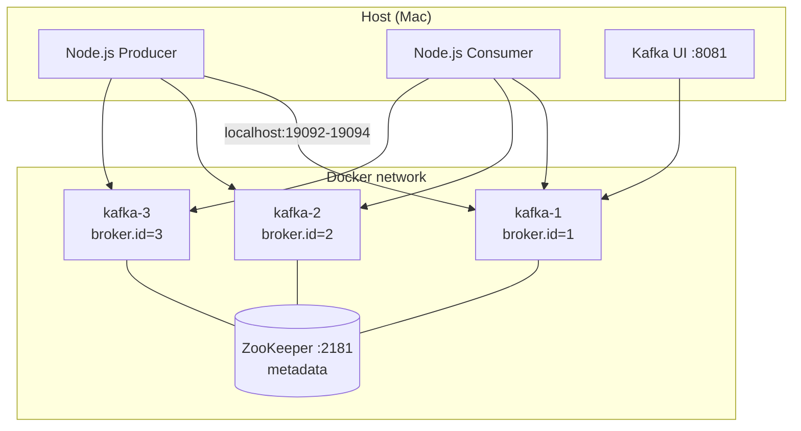
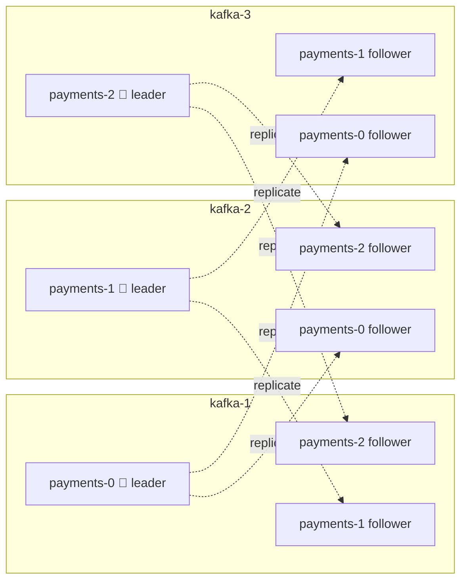
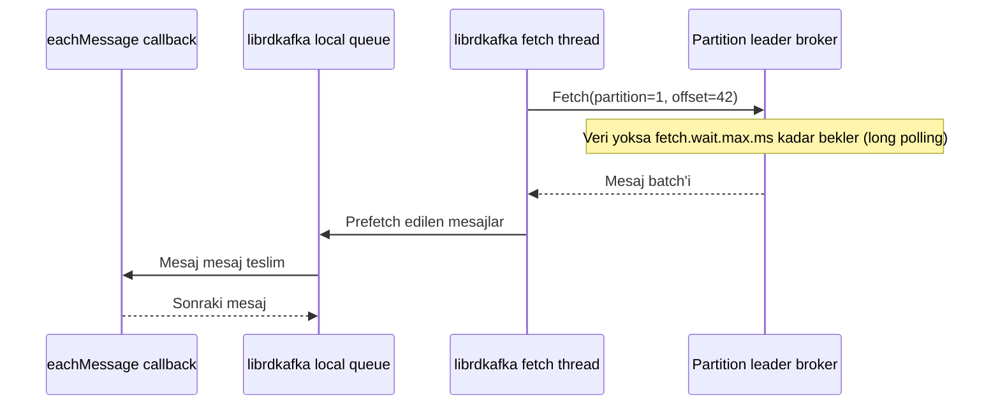

:::note[Kafka Lab serisi, bölüm 1]

Bu seri Kafka'yı dokümantasyon üzerinden değil, lokal bir cluster'ı kırıp
davranışını gözlemleyerek ele alır. Bağlam bir ödeme sistemidir; ancak amaç
sistem tasarımı değil, Kafka'nın iç işleyişidir.

:::

Bu ilk bölüm temelleri kapsar: cluster'ın anatomisi, partition ile replica
arasındaki ilişki, bir mesajın diskte fiziksel olarak nasıl durduğu ve Node.js
ile yazılmış bir producer/consumer çifti.

{/* truncate */}

## Neden "kırarak" öğrenmek?

Kafka hakkında okunacak çok şey vardır: ISR, high watermark, idempotent
producer, rebalance... Ancak bu kavramların çoğu, bir şey ters gidene kadar
soyut kalır. Bu serinin her modülü aynı döngüyü izler: **kır → gözlemle →
açıkla.**

Bağlam olarak ödeme domain'i seçilmiştir, çünkü Kafka'nın garantilerinin
gerçekten para ettiği yer burasıdır. Kurgu bilerek minimal tutulmuştur:

- Tek bir `payments` topic'i
- Key: `accountId`
- Value: bir `PaymentEvent` (paymentId, accountId, amount, currency, createdAt)

Her deney şu iki sorudan birine bağlanır:

> _"Ödeme kaybolur mu?"_ ve _"Para iki kez çekilir mi?"_

## Lab ortamı

Lokal ortam Docker Compose ile ayağa kaldırılan şu bileşenlerden oluşur:

- **3 Kafka broker** (Confluent Platform 7.9 / Kafka 3.9)
- **ZooKeeper** (tek node, cluster metadata'sı için)
- **Kafka UI** (kafbat)
- Node.js ile yazılmış küçük bir producer ve consumer

Broker sayısının üç olmasının nedeni basittir: tek broker ile Kafka'nın en
kritik özellikleri gözlemlenemez. Replication factor en fazla 1 olabilir,
failover diye bir şey yoktur, `min.insync.replicas` anlamsızlaşır. Üç broker
ile bir broker'ı durdurup sistemin nasıl tepki verdiği izlenebilir.



Her broker iki listener üzerinden erişilebilir: container ağı içinden
`kafka-N:29092` (broker'lar arası trafik ve CLI), host'tan ise
`localhost:1909X` (Node.js uygulamaları). Client ilk bağlantıda broker'dan
metadata alır ve sonraki isteklerde broker'ın **advertised listener** adresini
kullanır; bu nedenle her broker'ın dışarıya duyurduğu adres farklı olmak
zorundadır.

Bilinçli bir diğer tercih `auto.create.topics.enable=false` ayarıdır. Var
olmayan bir topic'e yazıldığında Kafka'nın sessizce varsayılan ayarlarla topic
açması istenmez; partition sayısı ve replication factor her zaman bilinçli bir
karar olmalıdır.

## Topic, partition ve replica: en sık karıştırılan ilişki

Kafka'ya yeni başlayanların sıkça sorduğu bir soru vardır: _"Replica'lar her
broker'ın kendi içinde mi tutulur, yoksa üç broker'dan ikisi replica mıdır?"_

Cevap: **ikisi de değil.** Kafka'da replication broker seviyesinde değil,
**partition seviyesinde** yapılır. "Ana broker" ya da "replica broker" diye bir
kavram yoktur; üç broker da eşittir.

Kurallar şunlardır:

1. Her partition'ın **replication factor (RF)** kadar kopyası olur.
2. Bu kopyaların her biri **farklı bir broker'da** durur. Bir broker aynı
   partition'ın birden fazla kopyasını tutamaz; aksi halde o broker çöktüğünde
   bütün kopyalar birlikte kaybolurdu.
3. Kopyalardan biri **leader**, diğerleri **follower** olur. Yazma ve okuma
   leader'dan yapılır; follower'lar leader'dan veri çekerek (fetch) güncel
   kalır.
4. Leader'lar broker'lara dağıtılır, böylece yük tek bir broker'da toplanmaz.

`payments` topic'i 3 partition ve RF=3 ile oluşturulduğunda yerleşim şöyledir:



RF broker sayısına eşit olduğu için her broker'da her partition'ın **tam bir**
kopyası bulunur. `kafka-1`'in diskinde `payments-0`'ın üç kopyası değil, tek
bir kopyası vardır. RF=2 olsaydı her partition üç broker'ın yalnızca ikisinde
bulunurdu. Gerçek bir cluster'da (örneğin 10 broker, RF=3) her broker
partition'ların yalnızca bir kısmını taşır.

:::tip[Akılda kalsın]

"Replica" broker'a değil, partition'ın kopyasına verilen isimdir. Her broker
aynı anda bazı partition'ların leader'ı, bazılarının follower'ı olabilir. RF
broker sayısından büyük olamaz; 3 broker'lı bir cluster'da RF=4 denemesi
`InvalidReplicationFactorException` ile sonuçlanır.

:::

## ZooKeeper'ın rolü ve controller

`zookeeper-shell` ile ZooKeeper'ın içine bakıldığında önemli bir ayrım
netleşir: **ZooKeeper'da mesaj verisi yoktur, yalnızca metadata vardır.**

| ZooKeeper path                                | Ne tutar                                                                  |
| --------------------------------------------- | ------------------------------------------------------------------------- |
| `/brokers/ids/N`                              | Canlı broker'lar ve endpoint'leri (ephemeral node: broker çöktüğünde silinir) |
| `/brokers/topics/payments`                    | Partition → replica ataması                                               |
| `/brokers/topics/payments/partitions/0/state` | leader, isr, leader_epoch; `kafka-topics --describe` çıktısının kaynağı   |
| `/controller`                                 | Hangi broker'ın controller olduğu                                         |
| `/controller_epoch`                           | Controller değişim sayacı                                                 |

**Controller**, broker'lardan biridir: `/controller` ephemeral node'unu ilk
oluşturan broker controller olur ve leader seçimi, partition ataması gibi
işleri yürütür. Controller çöktüğünde node silinir ve başka bir broker onun
yerini alır. `controller_epoch` her değişimde artar; böylece ağdan kopup geri
gelen eski bir controller'ın (zombie controller) komutları reddedilebilir. Aynı
"epoch ile fencing" fikriyle Kafka'nın başka katmanlarında da (leader epoch,
producer epoch) karşılaşılır.

Consumer offset'leri de ZooKeeper'da değil, Kafka'nın kendi içindeki
`__consumer_offsets` topic'inde tutulur. Çok eski sürümlerde bu bilgi
ZooKeeper'daydı; yüksek yazma yükü nedeniyle Kafka'ya taşındı.

## Bir ödeme diskte nasıl durur?

Bir partition diskte tek bir dosya değil, bir klasördür ve **segment**
dosyalarına bölünür:

```text
/var/lib/kafka/data/payments-0/
  00000000000000000000.log        ← mesajların kendisi (append-only)
  00000000000000000000.index      ← offset → byte pozisyonu (sparse)
  00000000000000000000.timeindex  ← timestamp → offset
  leader-epoch-checkpoint
  partition.metadata
```

- Dosya adı, segmentin **base offset**'idir: o segmentteki ilk mesajın
  offset'i.
- Segment boyutu (`segment.bytes`) dolduğunda yeni bir segment açılır
  (**segment roll**). Yalnızca en son segment aktiftir ve yazma oraya yapılır.
- Retention **segment bazında** çalışır: süresi dolan eski segment dosyası
  bütün olarak silinir. Tek tek mesaj silmek gerekmediği için retention çok
  ucuzdur.
- Index **sparse**'tır: her mesaj için değil, belirli aralıklarla
  (`index.interval.bytes`) kayıt tutar. Belirli bir offset aranırken önce
  index'te en yakın küçük kayıt bulunur, ardından `.log` dosyası oradan
  itibaren sıralı taranır.

`kafka-dump-log` ile `.log` dosyası incelendiğinde mesajların tek tek değil
**batch** halinde saklandığı görülür (`baseOffset`, `lastOffset`, `count`).
Batch başlığındaki `producerId`, `producerEpoch` ve `baseSequence` alanları,
bir sonraki bölümün konusu olan idempotent producer'ın temelini oluşturur.

## Node.js ile producer ve consumer

### Kütüphane seçimi

Node.js dünyasında en popüler client KafkaJS'tir; ancak 2023'ten beri fiilen
bakımsızdır ve Kafka protokolünü sıfırdan JavaScript ile yeniden yazdığı için
config isimleri ve davranışları Java client'tan farklıdır. Kafka'yı
derinlemesine öğrenmek için yanıltıcı olabilir. Bu lab'da Confluent'in resmi,
librdkafka tabanlı client'ı `@confluentinc/kafka-javascript` kullanılır: config
isimleri (`acks`, `linger.ms`, `enable.idempotence`...) Java client ile büyük
ölçüde aynıdır, dolayısıyla burada öğrenilenler Spring tarafına doğrudan
aktarılır.

### Config'i koddan ayırmak

Lab'ın en önemli tasarım kuralı şudur: **deney yapılırken kod değil config
değiştirilir.** Bunun için Confluent Docker image'larının kullandığı kural
client tarafına da uygulanır: `KAFKA_` ile başlayan her env değişkeni bir Kafka
property'sidir; prefix atılır, harfler küçültülür, `_` yerine `.` konur.

Producer'ın tüm ayarları tek bir env dosyasında toplanır:

```bash title="producer.env"
TOPIC=payments
COUNT=10
INTERVAL_MS=500

KAFKA_BOOTSTRAP_SERVERS=localhost:19092,localhost:19093,localhost:19094
KAFKA_CLIENT_ID=payment-producer
KAFKA_ACKS=all
KAFKA_ENABLE_IDEMPOTENCE=true
# KAFKA_LINGER_MS=5
# KAFKA_PARTITIONER=murmur2_random
```

`config.js` bu değişkenleri librdkafka property'lerine çevirir:

```javascript title="config.js"
const PREFIX = "KAFKA_";

// "true"/"false" → boolean, tam sayı → number, gerisi string
const coerce = (value) => {
  if (value === "true") return true;
  if (value === "false") return false;
  if (/^-?\d+$/.test(value)) return Number(value);
  return value;
};

const toPropertyName = (envName) =>
  envName.slice(PREFIX.length).toLowerCase().replaceAll("_", ".");

export const kafkaConfig = Object.fromEntries(
  Object.entries(process.env)
    .filter(([name]) => name.startsWith(PREFIX))
    .map(([name, value]) => [toPropertyName(name), coerce(value)])
);

export const appConfig = {
  topic: process.env.TOPIC,
  count: Number(process.env.COUNT ?? 1),
  intervalMs: Number(process.env.INTERVAL_MS ?? 0),
  consumerName: process.env.CONSUMER_NAME ?? `consumer-${process.pid}`,
};
```

`coerce` adımı küçük ama önemlidir: JavaScript'te `"false"` string'i
truthy'dir; çevrilmeden geçirilen `KAFKA_ENABLE_AUTO_COMMIT=false` beklenenin
tam tersi bir davranışa yol açabilir.

Env dosyaları Node'un yerleşik `--env-file` desteğiyle yüklenir; ek bir paket
gerekmez:

```json title="package.json"
"scripts": {
  "producer": "node --env-file=producer.env producer.js",
  "consumer": "node --env-file=consumer.env consumer.js"
}
```

Komut satırında verilen değer env dosyasındakini ezer. Böylece bir deney tek
satırla ifade edilir: `KAFKA_ACKS=1 npm run producer`.

### Producer

```javascript title="producer.js"
import { KafkaJS } from "@confluentinc/kafka-javascript";
import { kafkaConfig, appConfig } from "./config.js";

const { Kafka } = KafkaJS;
const producer = new Kafka().producer(kafkaConfig);

const main = async () => {
  await producer.connect();

  const payments = [
    { paymentId: crypto.randomUUID(), accountId: "acc-1", amount: 100, currency: "TRY", createdAt: new Date().toISOString() },
    { paymentId: crypto.randomUUID(), accountId: "acc-2", amount: 100, currency: "TRY", createdAt: new Date().toISOString() },
    // ...
  ];

  for (const payment of payments) {
    await producer.send({
      topic: appConfig.topic,
      messages: [{ key: payment.accountId, value: JSON.stringify(payment) }],
    });
  }

  await producer.disconnect();
};

main().catch(async (err) => {
  console.error("Producer error:", err);
  await producer.disconnect().catch(() => {});
  process.exit(1);
});
```

İki noktaya dikkat etmek gerekir. Birincisi key seçimidir: key olarak
`paymentId` değil `accountId` kullanılır, çünkü amaç aynı hesabın ödemelerini
aynı partition'a, dolayısıyla sıralı tutmaktır. İkincisi döngü tipidir; bu
konu aşağıda ayrıca ele alınır.

### forEach + await tuzağı

Ödemeleri göndermek için akla ilk gelen yazım şudur:

```javascript
payments.forEach(payment =>
  await producer.send({ ... }))
```

Bu kod önce `SyntaxError` verir: `await` async olmayan bir callback içinde
kullanılamaz. Callback'i `async` yapmak ise daha sinsi bir hataya yol açar:
`forEach` dönen promise'leri beklemez, döngü anında biter ve kod
`producer.disconnect()`'e geçer. Mesajlar gönderilmeden bağlantı kapanabilir ve
hatalar hiçbir yerde yakalanmaz. Doğru çözüm, yukarıdaki producer'da kullanılan
`for...of` döngüsüdür.

Bu tercih Kafka açısından da anlamlıdır: sıralı gönderim, aynı hesabın
ödemelerinin broker'a yazım sırasıyla ulaşmasını garanti eder. Alternatif
olarak tüm ödemeler tek bir `send()` çağrısında `messages` dizisiyle
gönderilebilir; bu hem daha verimlidir hem de diskte tek bir batch olarak
görünür.

### Consumer

```javascript title="consumer.js"
import { KafkaJS } from "@confluentinc/kafka-javascript";
import { kafkaConfig, appConfig } from "./config.js";

const { Kafka } = KafkaJS;
const name = appConfig.consumerName;
const consumer = new Kafka().consumer(kafkaConfig);

const main = async () => {
  await consumer.connect();
  await consumer.subscribe({ topics: [appConfig.topic] });

  await consumer.run({
    eachMessage: async ({ partition, message }) => {
      // key ve value Buffer olarak gelir — Kafka için hepsi byte
      const key = message.key?.toString();
      const payment = JSON.parse(message.value.toString());

      console.log(`[${name}] [p=${partition} off=${message.offset}] ${key} →`, payment);
    },
  });
};

const shutdown = async (signal) => {
  console.log(`[${name}] ${signal} alındı, kapanıyor...`);
  await consumer.disconnect();
  process.exit(0);
};

process.on("SIGINT", () => shutdown("SIGINT"));
process.on("SIGTERM", () => shutdown("SIGTERM"));

main().catch(async (err) => {
  console.error(`[${name}] Consumer error:`, err);
  await consumer.disconnect().catch(() => {});
  process.exit(1);
});
```

- `subscribe` consumer'ı bir topic'e abone eder, ancak hangi partition'ların
  okunacağına consumer karar vermez; group coordinator partition'ları
  group'taki consumer'lara dağıtır.
- `message.key` ve `message.value` `Buffer` olarak gelir. Kafka için her şey
  byte'tır; producer'daki `JSON.stringify` işleminin tersi burada `JSON.parse`
  ile yapılır.
- `SIGINT`/`SIGTERM` yakalanıp `disconnect()` çağrılması consumer'ın
  group'tan düzgünce ayrılmasını sağlar. Böylece kalan consumer'lar
  `session.timeout.ms` dolmasını beklemeden hemen rebalance edilir.

## Key → partition: acc-1 ve acc-3 neden aynı partition'a düşer?

Producer ile beş ödeme gönderildiğinde `acc-1` ile `acc-3`'ün aynı partition'a
düştüğü görülür. İlk bakışta bir hata gibi görünse de bu beklenen bir
davranıştır.

Partition seçimi şu formülle yapılır:

```text
partition = hash(key) % partition_sayısı
```

Kafka'nın garantisi **"aynı key her zaman aynı partition'a gider"**
şeklindedir. Tersi, yani "farklı key'ler farklı partition'lara gider", garanti
değildir. 3 key'in 3 partition'a birebir dağılma ihtimali yalnızca 3!/3³ ≈
%22'dir; en az iki key'in çakışma ihtimali yaklaşık %78'dir. Gerçek bir
sistemde milyonlarca hesap bulunacağı için her partition zaten binlerce hesabı
taşır.

Bu durum sıralama garantisini bozmaz. Partition içinde sıra yazım sırasıdır;
`acc-1` ve `acc-3`'ün ödemeleri aynı partition'da iç içe dursa da her hesabın
ödemeleri kendi arasında sıralıdır. Tek yan etkisi, aynı partition'daki
hesapların aynı consumer tarafından sırayla işlenmesidir: bir hesap trafiğin
büyük kısmını alırsa (büyük bir merchant gibi) **hot partition** oluşur.

### Gizli tuzak: farklı client'lar, farklı hash

Burada kritik bir detay vardır. **Java client** varsayılan olarak **murmur2**
hash kullanır. librdkafka tabanlı client'ların varsayılan partitioner'ı ise
**CRC32** tabanlıdır (`consistent_random`). Yani aynı `acc-1` key'i, Java
servisinden gönderildiğinde bir partition'a, Node servisinden gönderildiğinde
başka bir partition'a düşebilir.

Karışık dilli bir sistemde bu, aynı hesabın ödemelerinin iki farklı
partition'a dağılması ve **sıralama garantisinin sessizce kaybolması** anlamına
gelir. Çözüm, bütün client'larda partitioner'ı hizalamaktır: librdkafka
tarafında `KAFKA_PARTITIONER=murmur2_random`.

## Consumer pull ile çalışır

Consumer kodunda açık bir poll döngüsü görünmez; bu, Kafka'nın push tabanlı
olduğu izlenimini verebilir. Durum tam tersidir: Kafka **pull tabanlıdır**.
Broker mesajı consumer'a itmez, consumer ister; döngü yalnızca kütüphanenin
içinde gizlidir.



- Consumer, atandığı her partition'ın **leader broker'ına** Fetch request
  gönderir.
- Veri yoksa broker boş cevap dönmek yerine bekler (**long polling**,
  `fetch.wait.max.ms`); böylece boş yere sürekli istek atılmaz.
- librdkafka arka planda **prefetch** yapar; `eachMessage` bu local queue'dan
  beslenir. Java client'ta aynı döngü `consumer.poll()` ile açıkça yazılır;
  Spring Kafka'nın `@KafkaListener`'ı da bu döngüyü arka planda çalıştırır.

Pull modelinin kazandırdıkları şunlardır: consumer kendi hızında okur
(**backpressure**), istediği offset'e geri dönüp tekrar okuyabilir
(**replay**), broker ise "kime neyi gönderdim" state'i tutmak zorunda kalmaz.
RabbitMQ gibi push tabanlı sistemlerle temel mimari fark budur.

:::warning[Mülakat tuzağı]

Poll etmek yalnızca mesaj almak değil, aynı zamanda "hâlâ çalışıyorum"
sinyalidir. Heartbeat ayrı bir thread'de gider, ancak `max.poll.interval.ms`
(varsayılan 5 dk) içinde yeni mesaj alınmazsa consumer group'tan atılır ve
rebalance başlar. Bu mekanizma "canlı ama takılmış" consumer'ı yakalar.

:::

## Çıkarımlar

- Replication **partition seviyesindedir**; bir broker bir partition'ın en
  fazla bir kopyasını tutar.
- ZooKeeper yalnızca **metadata** tutar; mesaj verisi ve consumer offset'leri
  Kafka'nın kendisindedir.
- Partition diskte **segment**'lere bölünmüş append-only bir log'dur;
  retention ucuzdur, index sparse'tır, mesajlar batch halinde yazılır.
- Aynı key aynı partition'a gider; farklı key'lerin farklı partition'a gitmesi
  garanti değildir. **Farklı dillerdeki client'ların hash fonksiyonları farklı
  olabilir.**
- Kafka config'ini koddan ayırmak, deneyleri tek satırlık komutlara indirger.
- Consumer **pull** eder; poll döngüsü aynı zamanda bir canlılık sinyalidir.

## Sırada ne var?

Bir sonraki bölümün konusu **Producer Internals**'tır: `acks=1` iken leader
durdurulduğunda bir ödemenin nasıl kaybolduğu ve idempotence kapalıyken
retry'ın nasıl duplicate ödemeye yol açtığı ele alınacak. "Ödeme kaybolur mu?"
sorusu ilk kez "evet, şu config ile" cevabını bulacak.
