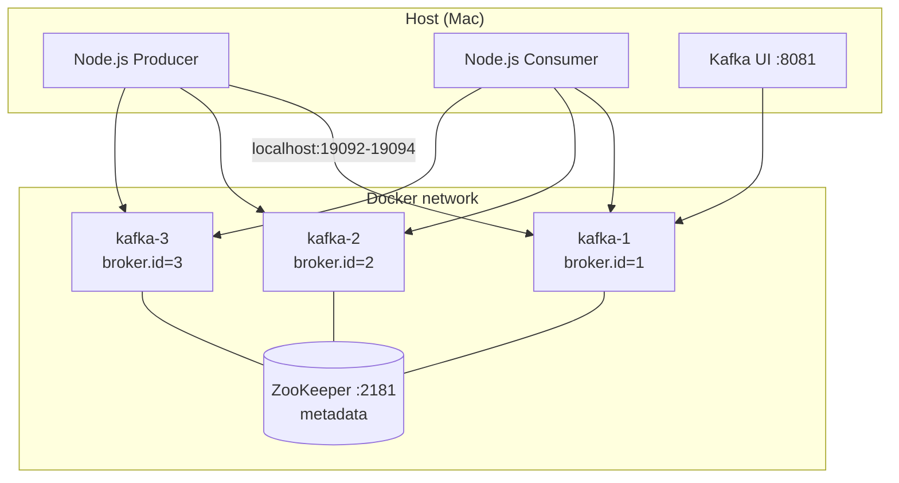
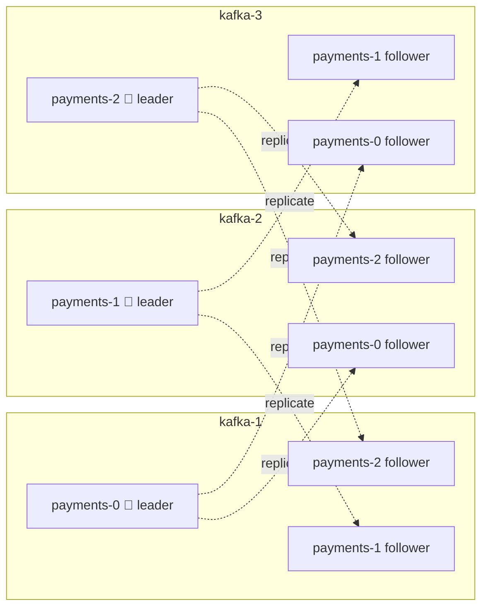
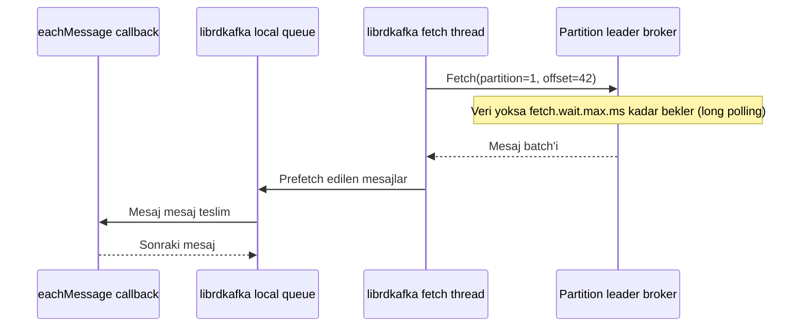

:::note[Kafka Lab serisi, bölüm 1]

Bu seride Kafka'yı dokümantasyon okuyarak değil, lokal bir cluster'ı kırıp
davranışını gözlemleyerek öğreniyoruz. Bağlam bir ödeme sistemi; ama amaç
sistem tasarımı değil, Kafka'nın iç işleyişi.

:::

Bu ilk bölüm temelleri kapsıyor: cluster'ın anatomisi, partition ve replica
ilişkisi, bir mesajın diskte fiziksel olarak nasıl durduğu ve client tarafında
öğrendiklerimiz.

{/* truncate */}

## Neden "kırarak" öğrenmek?

Kafka hakkında okunacak çok şey var: ISR, high watermark, idempotent producer,
rebalance... Ancak bu kavramların çoğu, bir şey ters gidene kadar soyut
kalıyor. Bu seride her modülde aynı döngüyü uyguluyoruz: **kır → gözlemle →
açıkla.**

Bağlam olarak ödeme domain'ini seçtik, çünkü Kafka'nın garantilerinin
gerçekten para ettiği yer burası. Kurgu bilerek minimal tutuldu:

- Tek bir `payments` topic'i
- Key: `accountId`
- Value: bir `PaymentEvent` (paymentId, accountId, amount, currency, createdAt)

Her deney şu iki sorudan birine bağlanıyor:

> _"Ödeme kaybolur mu?"_ ve _"Para iki kez çekilir mi?"_

## Lab ortamı

Lokalde Docker Compose ile şu ortamı kurduk:

- **3 Kafka broker** (Confluent Platform 7.9 / Kafka 3.9)
- **ZooKeeper** (tek node)
- **Kafka UI** (kafbat)
- Node.js ile yazılmış küçük bir producer ve consumer

### Neden ZooKeeper?

Çalıştığımız projede hâlâ ZooKeeper kullanılıyor; lab'ın üretimdeki
gerçeklikle örtüşmesini istedik. Bunun bir bedeli var: **ZooKeeper desteği
Kafka 4.0'da tamamen kaldırıldı.** Bu yüzden ZooKeeper'ı destekleyen son sürüm
hattı olan Kafka 3.9'u kullanıyoruz. KRaft'a geçiş, ileride ayrıca ele alınması
gereken bir migration konusu.

### Neden 3 broker?

Tek broker'la Kafka'nın en kritik özellikleri gözlemlenemiyor: replication
factor en fazla 1 olabiliyor, failover diye bir şey yok,
`min.insync.replicas` anlamsızlaşıyor. 3 broker ile bir broker'ı öldürüp
sistemin nasıl tepki verdiğini izleyebiliyoruz.



Her broker iki listener ile yayın yapıyor: container ağı içinden
`kafka-N:29092` (broker'lar arası trafik ve CLI), host'tan ise
`localhost:1909X` (Node.js uygulamaları). Client ilk bağlantıda broker'dan
metadata alır ve sonraki isteklerde broker'ın **advertised listener** adresini
kullanır; bu yüzden her broker'ın dışarıya duyurduğu adres farklı olmak
zorunda.

Bir diğer bilinçli tercih: `auto.create.topics.enable=false`. Var olmayan bir
topic'e yazıldığında Kafka'nın sessizce varsayılan ayarlarla topic açmasını
istemiyoruz; partition sayısı ve replication factor her zaman bilinçli bir
karar olmalı.

## Topic, partition ve replica: en sık karıştırılan ilişki

Lab'ın ilk "aha" anı burada yaşandı. Soru şuydu: _"Broker'ların kendi içinde
mi replica'ları var, yoksa 3 broker'dan 2'si replica mı?"_

Cevap: **ikisi de değil.** Kafka'da replication broker seviyesinde değil,
**partition seviyesinde** yapılır. "Ana broker" ya da "replica broker" diye bir
kavram yok; üç broker da eşit.

Kurallar:

1. Her partition'ın **replication factor (RF)** kadar kopyası olur.
2. Bu kopyaların her biri **farklı bir broker'da** durur. Bir broker aynı
   partition'ın birden fazla kopyasını tutamaz; aksi halde o broker öldüğünde
   bütün kopyalar birlikte kaybolurdu.
3. Kopyalardan biri **leader**, diğerleri **follower** olur. Yazma ve okuma
   leader'dan yapılır; follower'lar leader'dan veri çekerek (fetch) güncel
   kalır.
4. Leader'lar broker'lara dağıtılır, böylece yük tek bir broker'da toplanmaz.

`payments` topic'ini 3 partition ve RF=3 ile oluşturduğumuzda yerleşim şöyle:



RF broker sayısına eşit olduğu için her broker'da her partition'ın **tam bir**
kopyası bulunuyor. `kafka-1`'in diskinde `payments-0`'ın üç kopyası değil, tek
bir kopyası var. RF=2 olsaydı her partition üç broker'ın yalnızca ikisinde
bulunurdu. Gerçek bir cluster'da (örneğin 10 broker, RF=3) her broker
partition'ların yalnızca bir kısmını taşır.

:::tip[Akılda kalsın]

"Replica" broker'a değil, partition'ın kopyasına verilen isimdir. Her broker
aynı anda bazı partition'ların leader'ı, bazılarının follower'ı olabilir. RF
broker sayısından büyük olamaz; 3 broker'lı bir cluster'da RF=4 denemek
`InvalidReplicationFactorException` ile sonuçlanır.

:::

## ZooKeeper'ın rolü ve controller

`zookeeper-shell` ile içeri baktığımızda şunu net olarak görüyoruz:
**ZooKeeper'da mesaj verisi yok, sadece metadata var.**

| ZooKeeper path                               | Ne tutuyor                                                                  |
| -------------------------------------------- | --------------------------------------------------------------------------- |
| `/brokers/ids/N`                             | Canlı broker'lar ve endpoint'leri (ephemeral node: broker ölünce silinir)   |
| `/brokers/topics/payments`                   | Partition → replica ataması                                                 |
| `/brokers/topics/payments/partitions/0/state` | leader, isr, leader_epoch; `kafka-topics --describe` çıktısının kaynağı     |
| `/controller`                                | Hangi broker'ın controller olduğu                                           |
| `/controller_epoch`                          | Controller değişim sayacı                                                   |

**Controller**, broker'lardan biridir: `/controller` ephemeral node'unu ilk
oluşturan broker controller olur ve leader seçimi, partition ataması gibi
işleri yürütür. Controller ölürse node silinir ve başka bir broker yerini alır.
`controller_epoch` her değişimde artar; bu sayede ağdan kopup geri gelen eski
bir controller'ın (zombie controller) komutları reddedilebilir. Aynı "epoch ile
fencing" fikri Kafka'nın başka yerlerinde de (leader epoch, producer epoch)
karşımıza çıkacak.

Consumer offset'leri de ZooKeeper'da değil, Kafka'nın kendi içindeki
`__consumer_offsets` topic'inde tutuluyor. Çok eski sürümlerde ZooKeeper'daydı;
yüksek yazma yükü nedeniyle Kafka'ya taşındı.

## Bir ödeme diskte nasıl duruyor?

Bir partition diskte tek bir dosya değil, bir klasördür ve **segment**
dosyalarına bölünür:

```text
/var/lib/kafka/data/payments-0/
  00000000000000000000.log        ← mesajların kendisi (append-only)
  00000000000000000000.index      ← offset → byte pozisyonu (sparse)
  00000000000000000000.timeindex  ← timestamp → offset
  leader-epoch-checkpoint
  partition.metadata
```

- Dosya adı, segmentin **base offset**'idir: o segmentteki ilk mesajın
  offset'i.
- Segment boyutu (`segment.bytes`) dolunca yeni bir segment açılır (**segment
  roll**). Sadece en son segment aktiftir ve yazma oraya yapılır.
- Retention **segment bazında** çalışır: süresi dolan eski segment dosyası
  bütün olarak silinir. Tek tek mesaj silmek gerekmediği için retention çok
  ucuzdur.
- Index **sparse**'tır: her mesaj için değil, belirli aralıklarla
  (`index.interval.bytes`) kayıt tutar. Belirli bir offset aranırken önce
  index'te en yakın küçük kayıt bulunur, sonra `.log` dosyası oradan itibaren
  sıralı taranır.

`kafka-dump-log` ile `.log` dosyasına baktığımızda mesajların tek tek değil
**batch** halinde saklandığını görüyoruz (`baseOffset`, `lastOffset`, `count`).
Batch başlığındaki `producerId`, `producerEpoch` ve `baseSequence` alanları,
bir sonraki bölümün konusu olan idempotent producer'ın temelini oluşturuyor.

## Key → partition: "acc-1 ve acc-3 neden aynı partition'a düştü?"

Node.js producer'ımızla beş ödeme gönderdik ve `acc-1` ile `acc-3`'ün aynı
partition'a düştüğünü gördük. İlk tepki "bir şey mi yanlış?" oldu. Değil.

Partition seçimi şu formülle yapılır:

```text
partition = hash(key) % partition_sayısı
```

Kafka'nın garantisi **"aynı key her zaman aynı partition'a gider"**. Tersi,
yani "farklı key'ler farklı partition'lara gider", garanti değildir. 3 key'in 3
partition'a birebir dağılma ihtimali sadece 3!/3³ ≈ %22; yani en az iki key'in
çakışma ihtimali yaklaşık %78. Gerçek bir sistemde milyonlarca hesap olacağı
için her partition zaten binlerce hesabı taşır.

Bu durum sıralama garantisini bozmaz. Partition içinde sıra yazım sırasıdır;
`acc-1` ve `acc-3`'ün ödemeleri aynı partition'da karışık dursa da her hesabın
kendi ödemeleri kendi arasında sıralıdır. Tek yan etkisi, aynı partition'daki
hesapların aynı consumer tarafından sırayla işlenmesi: bir hesap trafiğin büyük
kısmını alırsa (büyük bir merchant gibi) **hot partition** oluşur.

### Gizli tuzak: farklı client'lar, farklı hash

Burada kritik bir detay var. **Java client** varsayılan olarak **murmur2** hash
kullanır. Node.js'te kullandığımız **librdkafka** tabanlı client'ların
varsayılan partitioner'ı ise **CRC32** tabanlıdır (`consistent_random`). Yani
aynı `acc-1` key'i, Java servisinden gönderildiğinde bir partition'a, Node
servisinden gönderildiğinde başka bir partition'a düşebilir.

Karışık dilli bir sistemde bu, aynı hesabın ödemelerinin iki farklı
partition'a dağılması ve **sıralama garantisinin sessizce kaybolması**
demektir. Çözüm, bütün client'larda partitioner'ı hizalamaktır (librdkafka'da
`partitioner=murmur2_random`).

## Consumer pull ile çalışır

Consumer'ı yazarken sorulan soru şuydu: _"Consumer Kafka'dan kendisi mi poll
ediyor?"_ Evet. Kafka **pull tabanlıdır**: broker mesajı consumer'a itmez,
consumer ister.



- Consumer, atandığı her partition'ın **leader broker'ına** Fetch request
  gönderir.
- Veri yoksa broker boş cevap dönmek yerine bekler (**long polling**,
  `fetch.wait.max.ms`); böylece boş yere sürekli istek atılmaz.
- librdkafka arka planda **prefetch** yapar; `eachMessage` bu local queue'dan
  beslenir. Java client'ta aynı döngü `consumer.poll()` ile açıkça yazılır;
  Spring Kafka'nın `@KafkaListener`'ı da bu döngüyü arka planda çalıştırır.

Pull modelinin kazandırdıkları: consumer kendi hızında okur (**backpressure**),
istediği offset'e geri dönüp tekrar okuyabilir (**replay**), broker ise "kime
neyi gönderdim" state'i tutmak zorunda kalmaz. RabbitMQ gibi push tabanlı
sistemlerle temel mimari fark budur.

:::warning[Mülakat tuzağı]

Poll etmek sadece mesaj almak değil, aynı zamanda "hâlâ çalışıyorum"
sinyalidir. Heartbeat ayrı bir thread'de gider, ancak `max.poll.interval.ms`
(varsayılan 5 dk) içinde yeni mesaj alınmazsa consumer group'tan atılır ve
rebalance başlar. Bu mekanizma "canlı ama takılmış" consumer'ı yakalar.

:::

## Node.js client tarafında öğrendiklerimiz

### Kütüphane seçimi

Node.js dünyasında en popüler client KafkaJS, ancak 2023'ten beri fiilen
bakımsız ve Kafka protokolünü sıfırdan JS ile yeniden yazdığı için config
isimleri ve davranışları Java client'tan farklı. Kafka'yı derinlemesine
öğrenmek için yanıltıcı olabilir. Bunun yerine Confluent'in resmi, librdkafka
tabanlı client'ı `@confluentinc/kafka-javascript`'i seçtik: config isimleri
(`acks`, `linger.ms`, `enable.idempotence`...) Java client ile büyük ölçüde
aynı, dolayısıyla burada öğrenilenler Spring tarafına doğrudan aktarılıyor.

### Config'i koddan ayırmak

Lab'ın en önemli tasarım kuralı: **deney yaparken kodu değil config'i
değiştiririz.** Bunun için Confluent Docker image'larının kullandığı kuralı
client tarafına da uyguladık:

```text
KAFKA_ ile başlayan her env değişkeni bir Kafka property'sidir:
prefix atılır → küçük harf → "_" yerine "."

KAFKA_LINGER_MS=5              → linger.ms: 5
KAFKA_ENABLE_IDEMPOTENCE=true  → enable.idempotence: true
```

Producer ve consumer'ın tüm ayarları kendi env dosyalarında (`producer.env`,
`consumer.env`) duruyor; deneyler için değerler komut satırında ezilebiliyor:
`KAFKA_ACKS=1 npm run producer`. Env'den gelen `"true"`/`"false"` değerlerinin
gerçek boolean'a çevrilmesi önemli: JavaScript'te `"false"` string'i truthy.

### forEach + await tuzağı

Ödemeleri gönderirken yazılan ilk versiyon şuydu:

```javascript
payments.forEach(payment =>
  await producer.send({ ... }))
```

Bu kod önce `SyntaxError` verir: `await` async olmayan bir callback içinde
kullanılamaz. Callback'i `async` yapmak ise daha sinsi bir hataya yol açar:
`forEach` dönen promise'leri beklemez, döngü anında biter ve kod
`producer.disconnect()`'e geçer. Mesajlar gönderilmeden bağlantı kapanabilir
ve hatalar hiçbir yerde yakalanmaz. Doğrusu `for...of`:

```javascript
for (const payment of payments) {
  await producer.send({ topic, messages: [{ key: payment.accountId, value: JSON.stringify(payment) }] });
}
```

Kafka açısından da anlamlı: sıralı gönderim, aynı hesabın ödemelerinin
broker'a yazım sırasıyla ulaşmasını garanti ediyor. Alternatif olarak tüm
ödemeler tek bir `send()` çağrısında `messages` dizisiyle gönderilebilir; bu
hem daha verimli hem de diskte tek batch olarak görünür.

## Çıkarımlar

- Replication **partition seviyesinde**dir; bir broker bir partition'ın en
  fazla bir kopyasını tutar.
- ZooKeeper yalnızca **metadata** tutar; mesaj verisi ve consumer offset'leri
  Kafka'nın kendisindedir.
- Partition diskte **segment**'lere bölünmüş append-only bir log'dur;
  retention ucuzdur, index sparse'tır, mesajlar batch halinde yazılır.
- Aynı key aynı partition'a gider, farklı key'lerin farklı partition'a gitmesi
  garanti değildir. **Farklı dillerdeki client'ların hash fonksiyonları farklı
  olabilir.**
- Consumer **pull** eder; poll döngüsü aynı zamanda bir canlılık sinyalidir.

## Sırada ne var?

Bir sonraki bölüm **Producer Internals**: `acks=1` iken leader'ı öldürüp bir
ödemenin kaybolduğunu, idempotence kapalıyken retry'ın nasıl duplicate ödemeye
yol açtığını göreceğiz. Yani ilk kez gerçekten "ödeme kaybolur mu?" sorusuna
"evet, şu config ile" diye cevap vereceğiz.
